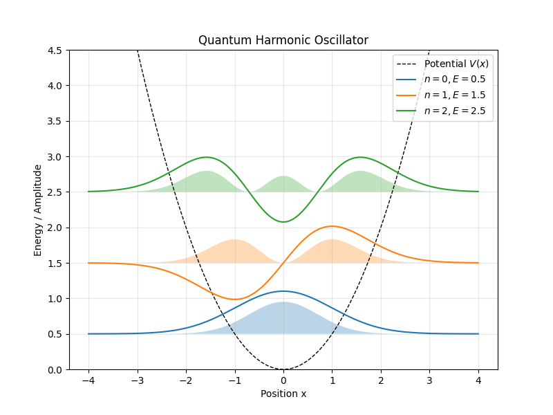

# 物理シミュレーション練習 (first-ex)

Pythonを使った物理シミュレーションの練習用リポジトリです。

## ファイルの説明
* **first.py**: 単振り子のグラフ描画コード
* **second.py**: 二重振り子のシミュレーションコード

## 環境
* Python

harmonic.py

# 量子調和振動子のシミュレーション

Pythonを使って、量子力学における調和振動子の波動関数と確率密度を計算し、可視化しました。

## 実行結果

背景の点線がポテンシャルエネルギー $V(x)$、各エネルギー準位にある色付きの領域が粒子の存在確率密度を表しています。

